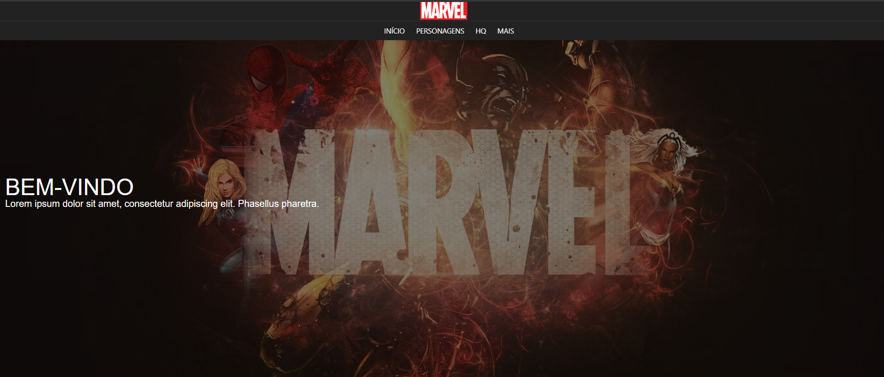

<h1 align="center">
  :boom:
  <br>
  <br>
  Marvel Test
</h1>

<h3 align="center">
<strong>Project developed for a job interview. <a href="https://rafashiga.github.io/marvel/" target="_blank">site</a></strong>
</h3>

<p align="center">

  
  
  
  
  <br>
  <br>
  <a href="#space_invader-technologies">Technologies</a>
  |
  <a href="#information_source-how-to-use">How to use</a>
  <br>
  <br>
  
  <br>
  <br>
</p>

## :space_invader: Technologies

- HTML
- Javascript
- CSS
- [ReactJS](https://pt-br.reactjs.org/)
- [Material UI](https://material-ui.com/pt/)
- [React Router](https://reacttraining.com/react-router/web/guides/quick-start)
- [react-fontawesome](https://github.com/FortAwesome/react-fontawesome)
- [Axios](https://github.com/axios/axios)

## :information_source: How to use

To run this project you'll need [GIT](https://git-scm.com/), [NodeJS](https://nodejs.org/en/) and [Yarn](https://yarnpkg.com/) installed on your computer.

```bash
# Clone this repository
$ git clone https://github.com/rafashiga/marvel-test.git

# Go into the repository
$ cd marvel-test

# Install dependencies
$ yarn install

# Run the project
$ yarn start
```
